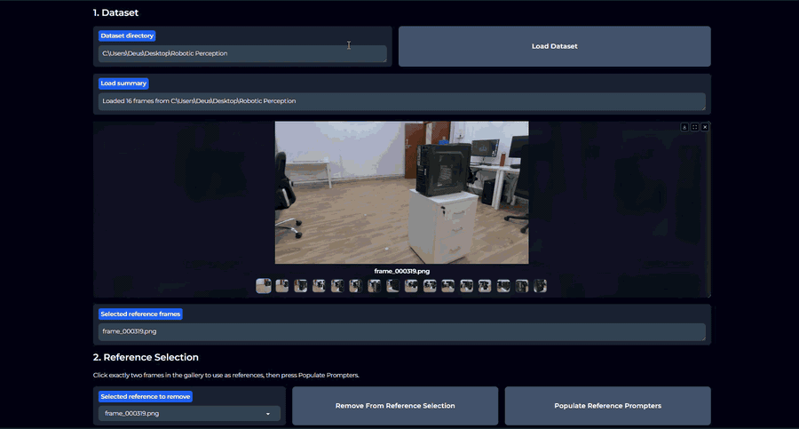

# Robotic Perception Project

Metric-semantic object localization from posed RGB images. This repository contains the cleaned project code for:

- supervised known-object detection with YOLO + SAHI,
- unsupervised / exemplar-based unknown-object detection experiments,
- T-Rex2 visual-prompting app for manual unknown-object localization,
- 2D detection to 3D oriented bounding box reconstruction.

The repo is intentionally lightweight. Large datasets, trained weights, generated outputs, notebooks, and zip archives are not committed.

## Project Goal

The project takes a set of posed RGB frames and estimates semantic 3D oriented bounding boxes (OBBs) for requested objects. The dataset provides:

- RGB images under `Data/`,
- camera intrinsics in `intrinsic.json`,
- camera poses in `poses.json`,
- a sample answer containing a valid `vga_socket` OBB.

The baseline target objects are known scene entities such as `power_socket` and `ethernet_socket`. The final evaluation may also include unknown objects, so the project includes both supervised and exemplar-based detection workflows.

## Repository Structure

```text
.
├── app/
│   ├── app.py
│   ├── trex2_api.py
│   ├── launch.ps1
│   ├── requirements.txt
│   └── README.md
├── supervised/
│   ├── prepare_yolo_dataset_from_annotations.py
│   ├── train_yolo.py
│   ├── sahi_yolo_inference.py
│   └── README.md
├── unsupervised/
│   ├── groundingdino_sliced_inference.py
│   ├── dinov2_sliding_window.py
│   ├── yoloworld_dinov2_exemplar.py
│   ├── dinov2_utils.py
│   ├── common.py
│   └── README.md
├── reconstruction/
│   ├── refit_nonml_geometric_obbs.py
│   ├── refit_generic_obbs.py
│   ├── refit_edge_anchor_obbs.py
│   ├── refit_mask_obbs.py
│   ├── rerun_yolo26_9class_sahi_and_reconstruct.py
│   ├── prepare_yolo26_9class_obb_inputs.py
│   ├── convert_obb_to_sample_answer.py
│   ├── compute_nonml_vga_polygon_iou.py
│   └── README.md
├── docs/
│   ├── project_report_detection.tex
│   ├── context.md
│   └── notebook_mapping.md
├── examples/
│   ├── dataset_layout.md
│   └── detection_record_format.json
├── requirements.txt
└── .gitignore
```

## Artifact Policy

The following are deliberately excluded from Git:

- `Data/`
- trained weights such as `*.pt`, `*.pth`, `*.onnx`
- generated outputs under `outputs/`, `runs/`, and `obb_reconstruction_inputs/`
- notebook files
- zip archives
- visualization images

To reproduce the project, place the dataset files beside this README or pass paths to scripts explicitly.

Expected dataset layout:

```text
Data/
  frame_000319.png
  frame_000333.png
  ...
intrinsic.json
poses.json
sample_answers.json
```

## Installation

Create a Python environment:

```powershell
python -m venv .venv
.\.venv\Scripts\Activate.ps1
pip install -r requirements.txt
```

For the T-Rex2 app, install the app-specific requirements:

```powershell
cd app
pip install -r requirements.txt
```

Some unsupervised methods require external model downloads from Hugging Face or Ultralytics. Use a GPU environment when possible.

## Workflow 1: Supervised Known-Object Detection

Use this branch for classes that have labels, such as:

- `power_socket`
- `ethernet_port`
- `vga_port`

### 1. Prepare YOLO Dataset

```powershell
python supervised/prepare_yolo_dataset_from_annotations.py `
  --annotations labels/annotations.json `
  --images Data `
  --out yolo_dataset `
  --class-map '{ "power_socket": 0, "ethernet_port": 1, "vga_port": 2 }'
```

This creates:

```text
yolo_dataset/
  images/train
  images/val
  labels/train
  labels/val
  data.yaml
```

### 2. Train YOLO

```powershell
python supervised/train_yolo.py `
  --data-yaml yolo_dataset/data.yaml `
  --weights yolo26s.pt `
  --project runs/yolo_known
```

Default training settings mirror the project experiments:

- image size: `1024`
- epochs: `100`
- batch size: `16`
- learning rate: `0.001`
- warmup epochs: `5`
- dropout: `0.1`

### 3. Run SAHI Sliced Inference

```powershell
python supervised/sahi_yolo_inference.py `
  --weights runs/yolo_known/train/weights/best.pt `
  --images Data `
  --out outputs/yolo_sahi
```

SAHI is important because the socket objects are small in full-frame images. The default inference uses:

- slice size: `512`
- overlap: `0.30`
- postprocess type: `NMM`

The output includes:

- `detections_flat.json`
- `detections_by_frame.json`
- `metadata.json`
- 2D visualization images

## Workflow 2: Unsupervised / Exemplar Detection

This branch documents the unknown-object detection experiments described in `docs/project_report_detection.tex`.

### GroundingDINO With Manual Slicing

```powershell
python unsupervised/groundingdino_sliced_inference.py `
  --images Data `
  --prompts "ethernet socket,power socket,connector" `
  --out outputs/groundingdino
```

This reproduces the sliced open-vocabulary detector experiments. It is useful for proposal generation but can overfire on clutter or large panel regions.

### DINOv2 Sliding-Window Exemplar Search

```powershell
python unsupervised/dinov2_sliding_window.py `
  --images Data `
  --reference-image Data/frame_000319.png `
  --reference-box 100 100 200 200 `
  --entity unknown_object `
  --out outputs/dinov2_sw
```

This performs pure visual similarity search against a reference crop. It avoids text-prompt ambiguity but is computationally heavier.

### YOLO-World Proposals + DINOv2 Reranking

```powershell
python unsupervised/yoloworld_dinov2_exemplar.py `
  --images Data `
  --reference-image Data/frame_000319.png `
  --reference-box 100 100 200 200 `
  --entity unknown_object `
  --out outputs/yoloworld_dinov2
```

This combines high-recall YOLO-World proposals with DINOv2 visual similarity ranking.

## Workflow 3: T-Rex2 OBB App

The app is the preferred interface for final unknown-object manual detection and 3D OBB fitting.

### App Demo

The short tour below shows the intended app workflow: load the posed-image dataset, choose two visual reference frames, run T-Rex2 on target frames, manually confirm candidates, fit a 3D OBB, inspect the projected OBB across frames, and export the cumulative output JSON.



### T-Rex2 App Installation

The app calls the hosted T-Rex2 HTTP API through `app/trex2_api.py`. It does not require a local T-Rex2 model checkout for normal use, but the original project and API documentation are useful references:

- T-Rex project repository: <https://github.com/IDEA-Research/T-Rex>
- DeepDataSpace / T-Rex2 API documentation: <https://deepdataspace.com/playground/ivp>

Install the app environment:

```powershell
cd app
python -m venv .venv
.\.venv\Scripts\Activate.ps1
pip install -r requirements.txt
```

You need a T-Rex2 API token from DeepDataSpace. Then launch:

```powershell
cd app
.\launch.ps1 -Token "YOUR_TREX2_API_TOKEN"
```

Optional custom port:

```powershell
.\launch.ps1 -Token "YOUR_TREX2_API_TOKEN" -Port 7863
```

App features:

- exactly two reference-image prompt boxes,
- selected-only candidate preview for easier manual checking,
- optional all-candidates preview,
- current-object observation clearing,
- cumulative output JSON export,
- all-frame horizontal-scroll OBB visualization,
- `auto_geometric` 3D OBB fitting that matches `reconstruction/refit_nonml_geometric_obbs.py`.

## Workflow 4: 3D OBB Reconstruction

The recommended reconstruction script is:

```powershell
python reconstruction/refit_nonml_geometric_obbs.py
```

It performs generic 2D-to-3D OBB fitting using:

- inverse pose convention,
- duplicate same-class/same-frame detection collapse,
- center-compact hypothesis,
- top/bottom-axis hypothesis,
- top/bottom-axis with support-contact hypothesis,
- upright-support hypothesis,
- planar-facing hypothesis,
- robust refit after dropping the worst observations.

The key output is:

```text
obb_reconstruction_inputs/yolo26_9class_nonml_geometric_refit/obb_estimates.json
```

Convert a chosen OBB file to teacher-format JSON with:

```powershell
python reconstruction/convert_obb_to_sample_answer.py
```

## Detection Record Format

The reconstruction scripts expect flat detections like:

```json
{
  "frame": "frame_000319.png",
  "detection_index": 0,
  "class": "power_socket",
  "raw_class": "power_socket",
  "class_id": 0,
  "confidence": 0.95,
  "bbox_xyxy_px": [1434.7, 644.2, 1459.8, 681.3],
  "center_px": [1447.2, 662.8]
}
```

See `examples/detection_record_format.json`.

## Important Implementation Notes

- The correct projection convention for this dataset is inverse pose usage.
- Duplicate detections of the same class in the same frame are collapsed to the largest box before 3D fitting.
- This duplicate handling fixed a major bottle reconstruction failure where a tiny fragment detection was treated as another view of the bottle.
- The app's `auto_geometric` OBB logic was parity-checked against `refit_nonml_geometric_obbs.py`.

## Documentation

- `docs/project_report_detection.tex`: detection-side project report.
- `docs/context.md`: current engineering context and reconstruction findings.
- `docs/notebook_mapping.md`: how original notebooks were distilled into scripts.

## Reproducibility Summary

The original notebooks were not committed. Their important sections were converted to maintainable scripts:

- YOLO training and SAHI inference: `supervised/`
- GroundingDINO slicing: `unsupervised/groundingdino_sliced_inference.py`
- DINOv2 sliding window: `unsupervised/dinov2_sliding_window.py`
- YOLO-World + DINOv2 exemplar ranking: `unsupervised/yoloworld_dinov2_exemplar.py`
- T-Rex2 visual prompting and OBB app: `app/`
- 3D OBB fitting: `reconstruction/`
